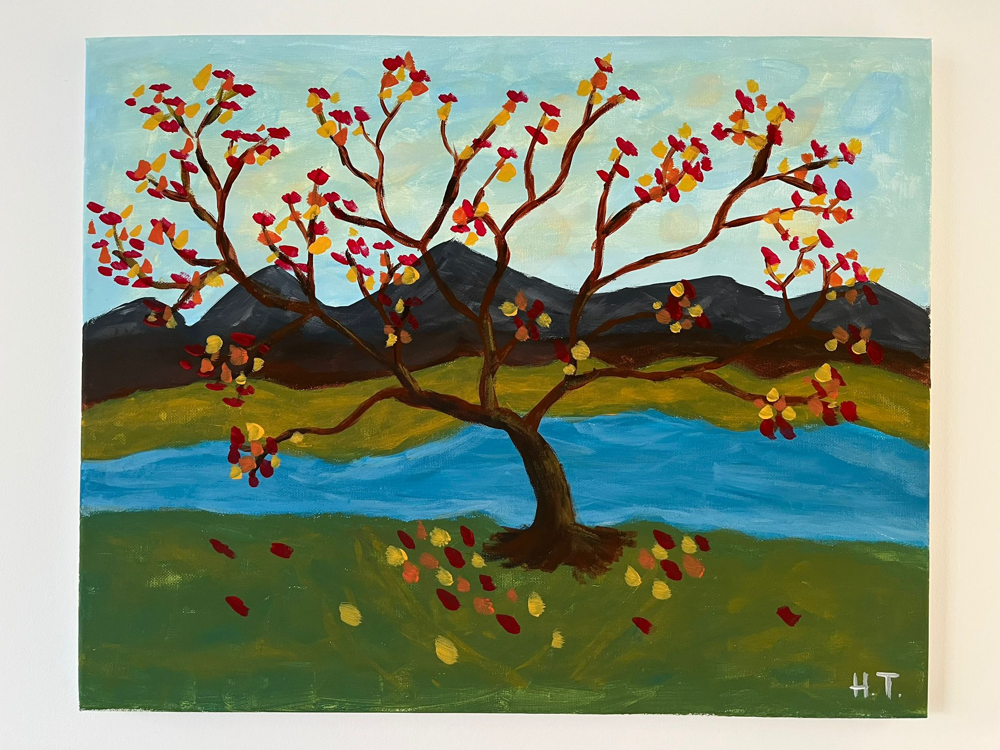

---
# the default layout is 'page'
icon: fas fa-info-circle
order: 1
---

### Hi there! 👋

I am a Developer / Analyst currently working at a Financial Institution. I love to work on projects that enables me to use different approaches and be creative while solving complex problems. I have a bachelor in Computer Engineering and recently graduated from a Web Development bootcamp at Lighthouse Labs.

### Skills

| Languages  | Frameworks/Libraries | Systems/DBs |  Testing  |
| :--------: | :------------------: | :---------: | :-------: |
| Javascript |        NodeJs        |  Postgres   |  Cypress  |
| Typescript |       ReactJs        |   MongoDB   | Storybook |
|   Python   |      ExpressJs       |     SQL     |   Jest    |
|    Ruby    |      MaterialUI      |     Git     |   Mocha   |
|    VBA     |         EJS          |   Docker    |   Chai    |
|    HTML    |        Axios         |    Jira     |   Rspec   |
|    CSS     |       Selenium       |             |           |

### Projects

> Please don't forget to check some of my projects on the left side 👈
> {: .prompt-info }

### Miscellaneous

When I am not coding, I take some time to go outdoors hiking, playing tennis, biking and snowboarding. I recently took a painting class and I am looking forward to explore the artistic side of me.

Thanks for stopping by and checking my profile =)
