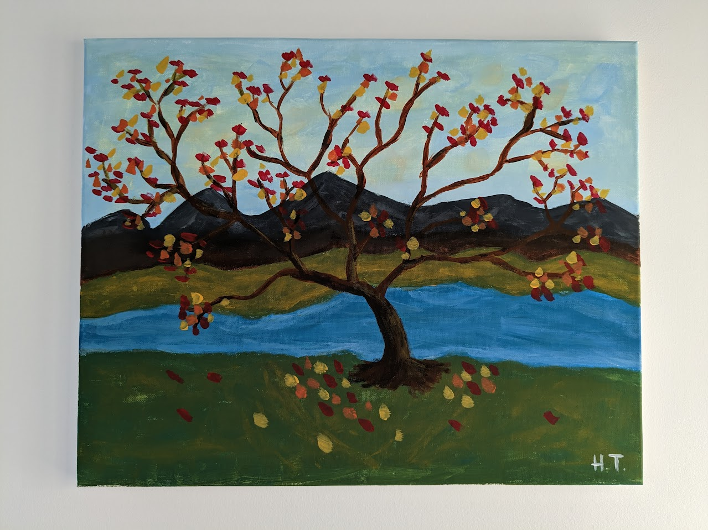

---
# the default layout is 'page'
icon: fas fa-info-circle
order: 1
---

<!-- > Add Markdown syntax content to file `_tabs/about.md`{: .filepath } and it will show up on this page.
> {: .prompt-tip } -->

### Hi there! 👋

I am a full stack developer currently working as a Business Innovation Analyst at a Financial Institution. I love to work on projects that enables me to use different approaches and be creative while solving complex problems. I have a bachelor in Computer Engineering and recently graduated from Lighthouse Labs bootcamp.

When I am not coding, I take some time to go outdoors hiking, playing tennis, biking and snowboarding. I recently took a painting class and I am looking forward to explore the artistic side of me.

Thanks for stopping by and checking my profile =)
