---
# the default layout is 'page'
icon: fas fa-info-circle
order: 2
---

## [F1 Race Predictions](https://hseiji.github.io/f1go/)

Machine Learning Model created to predict F1 GP winners based on past performance, qualifying lap times, and historical F1 data.
This model utilizes FastF1 API for historical F1 data (race results, qualifying times, among other metrics).
There are many future improvements that I would like to learn and add to this model.

Expected output example:
```
🏁 Predicted GP Winner 🏁
Predicted Lap Times and GP Winner:

  Abbreviation  Q3_seconds  Predicted_LapTime (s)
1          NOR      86.269              93.968200
2          ANT      86.271              93.968200
7          LEC      86.754              94.219445
0          VER      86.204              94.605306
```

## [Dracaena Marginata](https://hseiji.github.io/dracaena-marginata/)

Responsive web page about the Dragon Tree or most known as Dracaena Marginata. You will find some interesting facts and details on how to keep your little plant friend alive.

### Tech stack: ReactJs, JavaScript, HTML/CSS/styled-components.

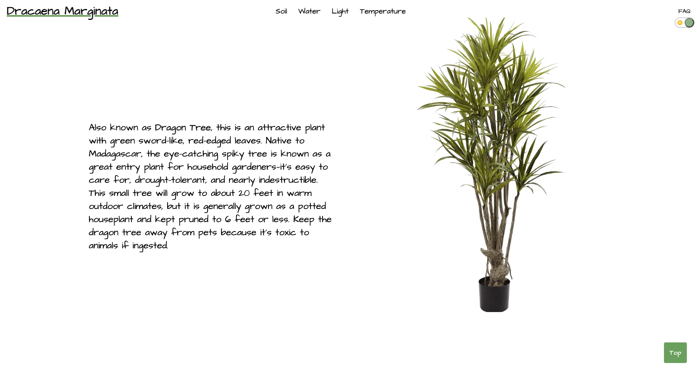
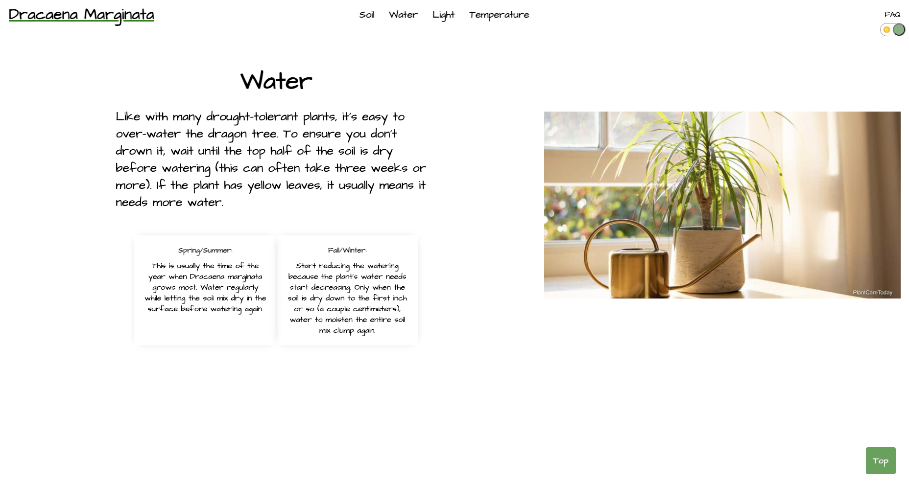
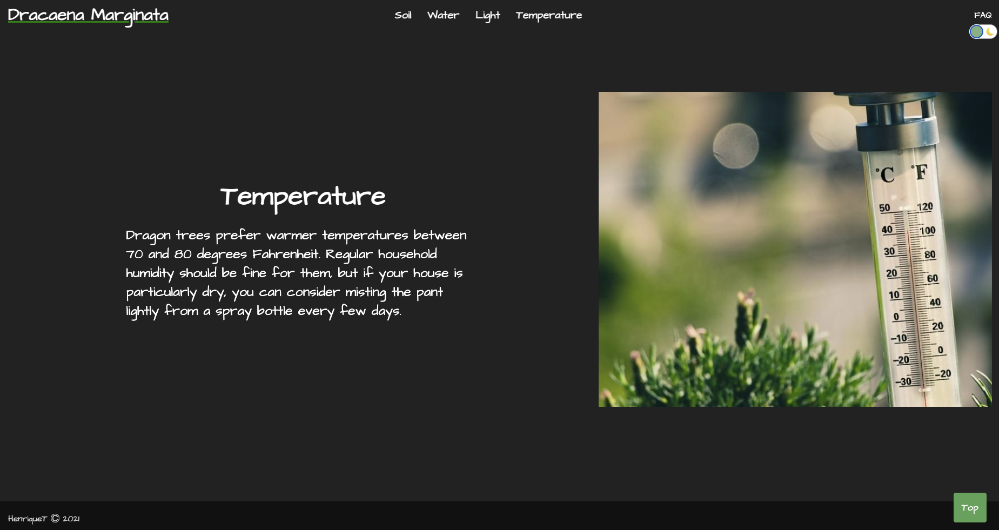

#### [Check it here](https://hseiji.github.io/dracaena-marginata/)

---

## [Green Room](https://hseiji.github.io/green-room-app/)

This webpage helps you to manage your plants based on few characteristics like, water, soil and light. Choose your own plants from the inventory, build and play around your Green Room.

### Tech stack: Typescript, HTML, CSS, ReactJs, Postgres and ExpressJs.

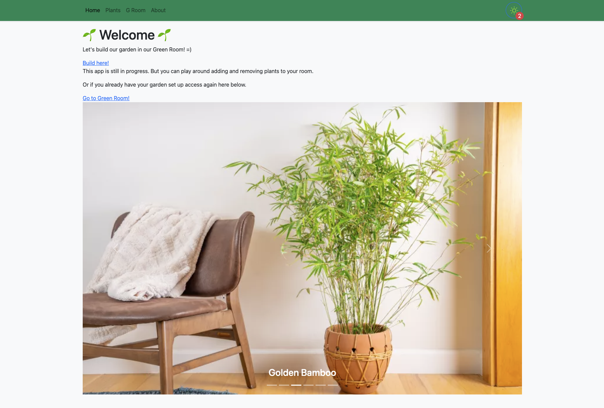
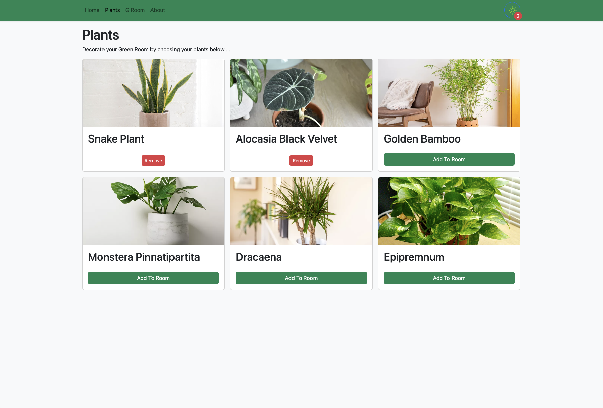
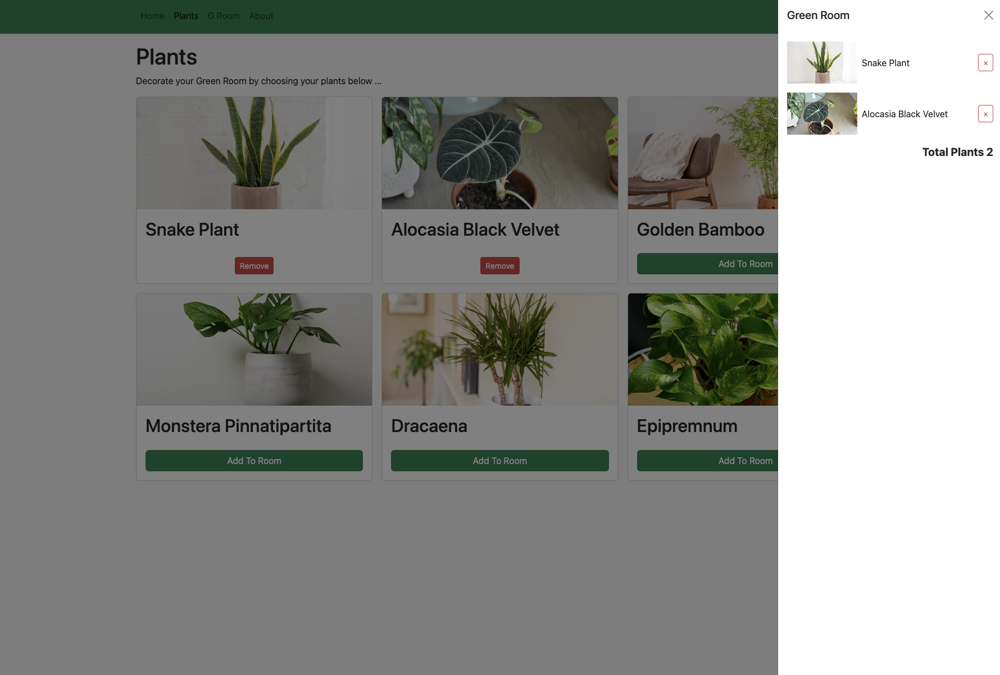
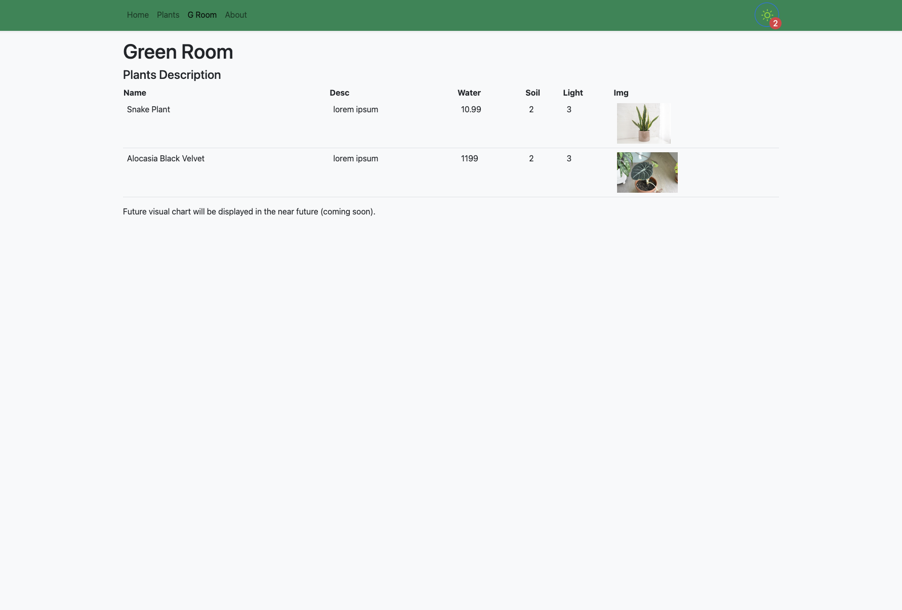

#### [Check it here](https://hseiji.github.io/green-room-app/)

---

## [Toronto Gems](https://blog-toronto-app.onrender.com/#/)

If you are new to the city of Toronto, don't worry we got you covered! Besides the must go places this blog contains some underrated spots worth checking before they get popular (nobody likes big lines for IG shots right?).

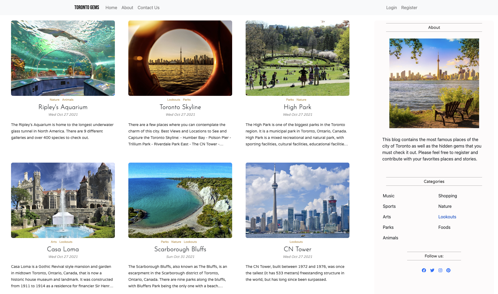
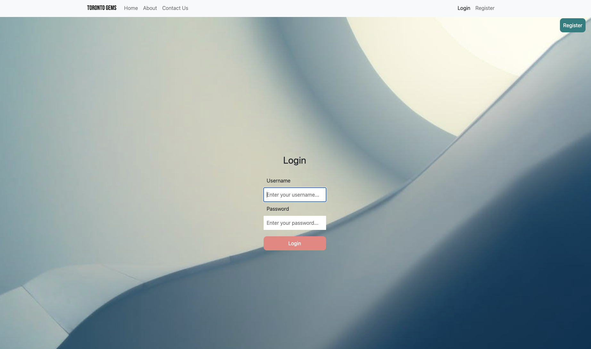
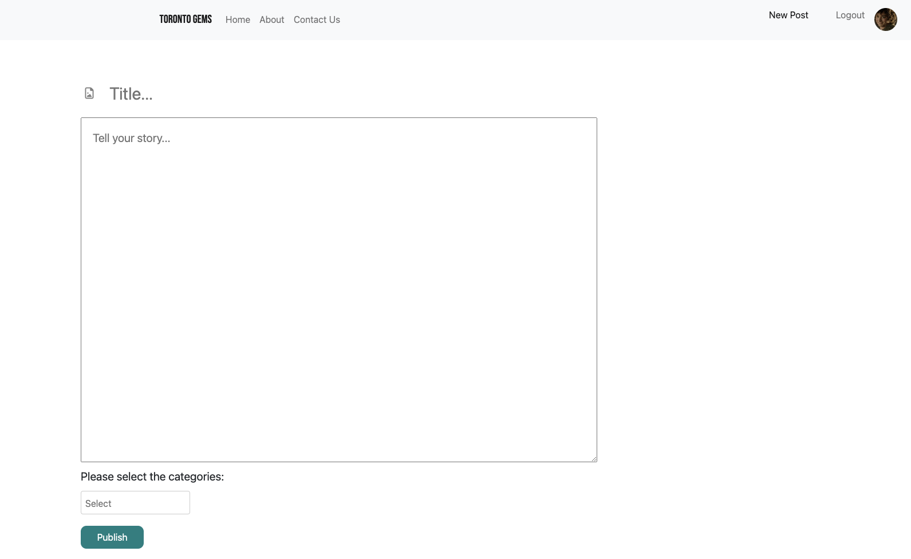

### Tech stack: MongoDB, ExpressJs, ReactJs, NodeJs, Javascript, HTML and CSS.

#### [Check it here](https://blog-toronto-app.onrender.com/#/)

---

## [Tripper](https://tripper-app.onrender.com/)

This app is perfect when you are going to a day trip or want to tour around the city. Feel free to create your own list of places, add them to your plan and visualize it on the map. Additionally, you can display the itinerary by clicking on the map icon.

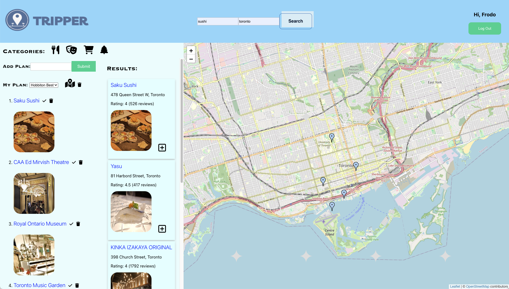

### Tech stack: Postgres, ExpressJs, ReactJs, NodeJs, Javascript, HTML and CSS.

#### [Check it here](https://tripper-app.onrender.com/)
