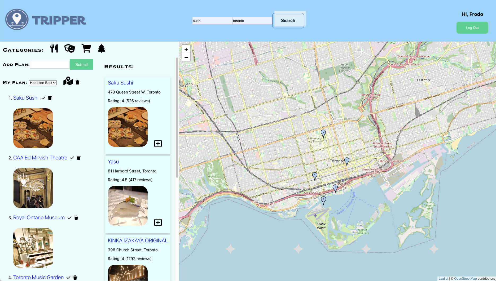
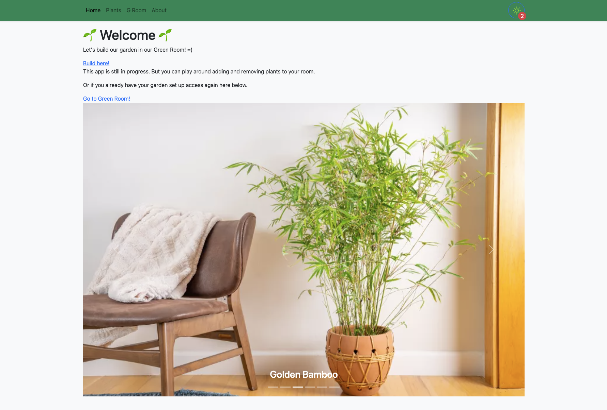
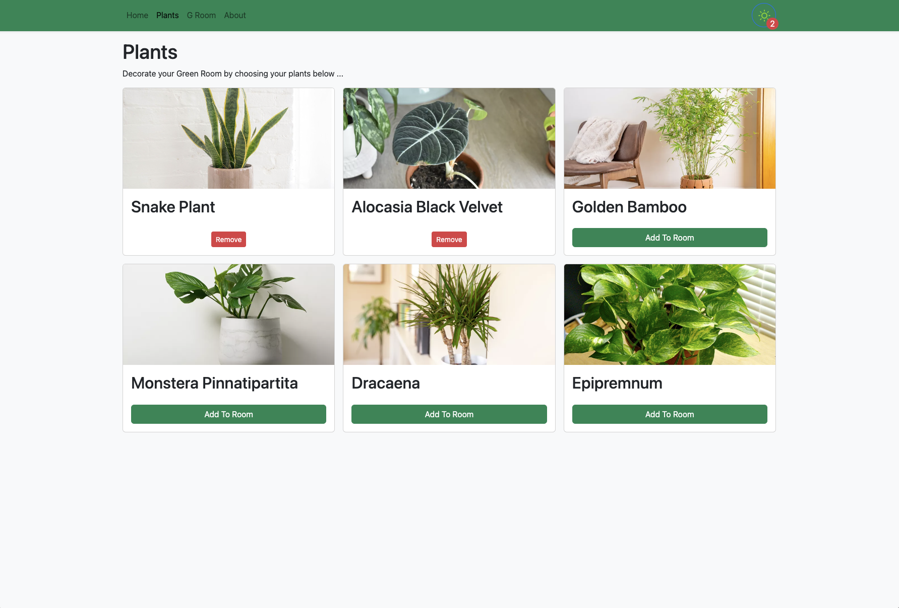
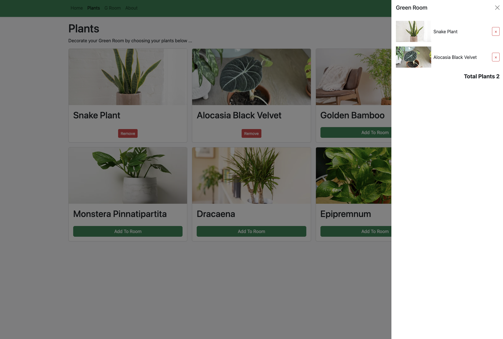
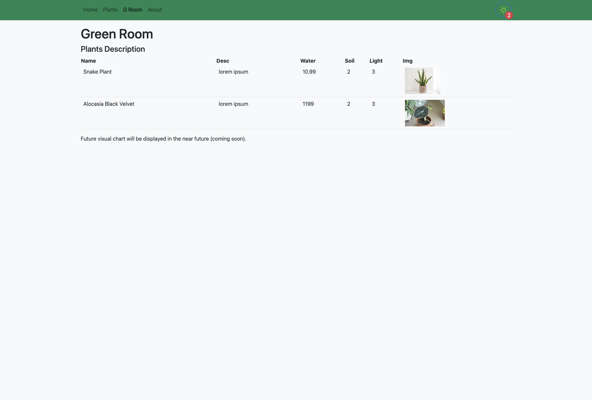
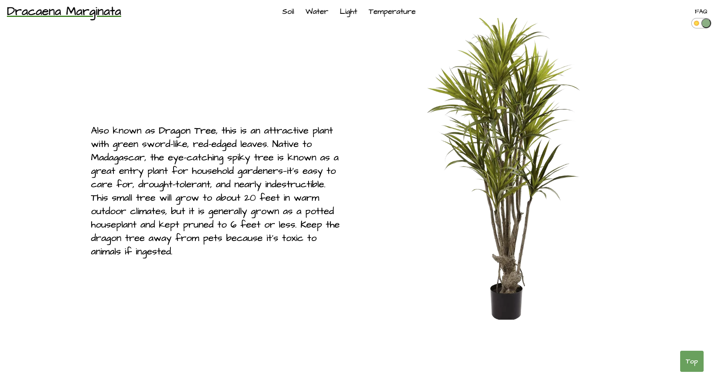
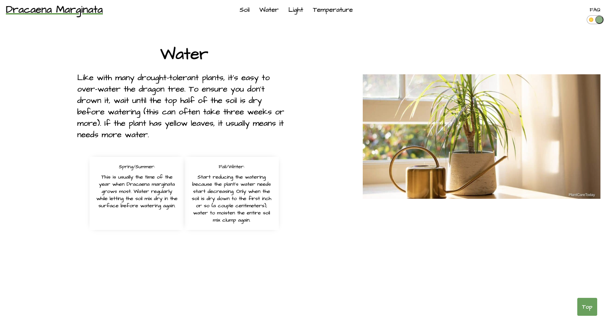
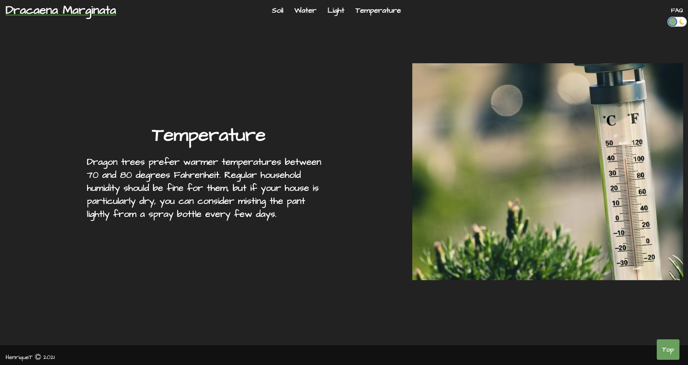

---
# the default layout is 'page'
icon: fas fa-info-circle
order: 2
---

<!-- ## [Toronto Gems]()

--- -->

## [Tripper](https://tripper-app.onrender.com/)

This app is perfect when you are going to a day trip or want to tour around the city. Feel free to create your own list of places, add them to your plan and visualize it on the map. Additionally, you can display the itinerary by clicking on the map icon.

### Tech stack: Postgres, ExpressJs, ReactJs, NodeJs, Javascript, HTML and CSS.

#### [Check it here](https://green-room-app.onrender.com)

---

## [Green Room](https://tripper-app.onrender.com/)

This webpage helps you to manage your plants based on few characteristics like, water, soil and light. Choose your own plants from the inventory, build and play around your Green Room.

### Tech stack: Typescript, HTML, CSS, ReactJs, Postgres and ExpressJs.

#### [Check it here](https://green-room-app.onrender.com)

---

## [Dracaena Marginata](https://hseiji.github.io/dracaena-marginata/)

Responsive web page about the Dragon Tree or most known as Dracaena Marginata. You will find some interesting facts and details on how to keep your little plant friend alive.

### Tech stack: ReactJs, JavaScript, HTML/CSS/styled-components.

#### [Check it here](https://hseiji.github.io/dracaena-marginata/)
